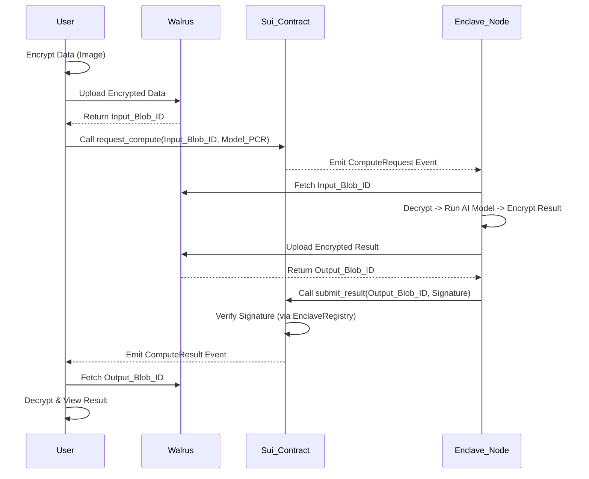

# Privacy-Preserving AI with Walrus & Sui - Hackathon Plan

## 1. Minimal Viable Scope (48-Hour Hackathon)

**Pitch:** "The first decentralized, privacy-preserving AI compute network where data never leaves the secure enclave unencrypted."

**The "Magic" User Flow:**
1.  **Upload:** User selects a sensitive image (e.g., a document or face). Client encrypts it and uploads to **Walrus**.
2.  **Request:** User signs a transaction on **Sui** to request a specific AI task (e.g., "Redact PII" or "Blur Faces").
3.  **Process:** An off-chain **Enclave** (simulated or real) detects the request, processes the image, and uploads the result to **Walrus**.
4.  **View:** User decrypts and views the result.

**Hackathon Constraints:**
*   **Ignore:** Complex subscription tiers, multi-model marketplaces, decentralized proving of TEE (use the existing `enclave_registry` but don't over-engineer the verification for the demo).
*   **Focus:** The **End-to-End Data Flow**. The "Wow" moment is seeing the result appear on-chain (as a Walrus Blob ID) and being the only one who can view it.

## 2. Technical Architecture

### Move Smart Contracts (Sui Objects)

You already have `enclave_registry` (Identity) and `subscription` (Access). You need a `compute_market` module to link them.

#### A. `ComputeRequest` (Sui Object)
Represents a user's intent to buy compute.
```move
struct ComputeRequest has key, store {
    id: UID,
    requester: address,
    input_blob_id: String, // Link to Walrus
    model_pcr: vector<u8>, // Which model to run
    public_key: vector<u8>, // User's ephemeral PK for result encryption
    fee_paid: Coin<SUI>,   // Escrowed payment
}
```

#### B. `ComputeResult` (Sui Object or Event)
The proof of work.
```move
struct ComputeResult has copy, drop {
    request_id: ID,
    worker_pcr: vector<u8>,
    output_blob_id: String, // Link to Walrus
    signature: vector<u8>,  // Proof it came from the Enclave
}
```

#### C. Walrus Link
*   **Storage:** Walrus stores the *encrypted* payloads.
*   **Linkage:** The `blob_id` (a 256-bit hash encoded as String or vector<u8>) is the foreign key stored in the Sui Object.
*   **Security:** The `ComputeRequest` on Sui includes the `public_key`. The Enclave uses this to encrypt the payload stored at `output_blob_id` in Walrus. Only the user can decrypt it.

### Data Flow Diagram



## 3. Implementation Steps

1.  **Modify `subscription.move`:** Ensure it can be easily checked by the `compute_market`.
2.  **Create `compute_market.move`:**
    *   `request_compute`: Takes payment, creates `ComputeRequest`.
    *   `fulfill_request`: Called by Enclave. Verifies signature against `enclave_registry`. Releases payment to Enclave. Emits `ComputeResult`.
3.  **Frontend/Script:**
    *   Mock the "Enclave" with a script that listens to events, downloads from Walrus, "processes" (sleeps/mocks), uploads to Walrus, and calls `fulfill_request`.

## Verification Plan

### Automated Tests
*   **Move Tests:** Unit tests for `compute_market` flow (request -> fulfill -> payout).
*   **Integration Script:** `run_pipeline.sh` (which you have started) will be updated to run the full cycle.

### Manual Verification
*   **Demo Flow:** Run the script. Check the Sui Explorer for the `ComputeResult` event containing a valid Walrus Blob ID.
